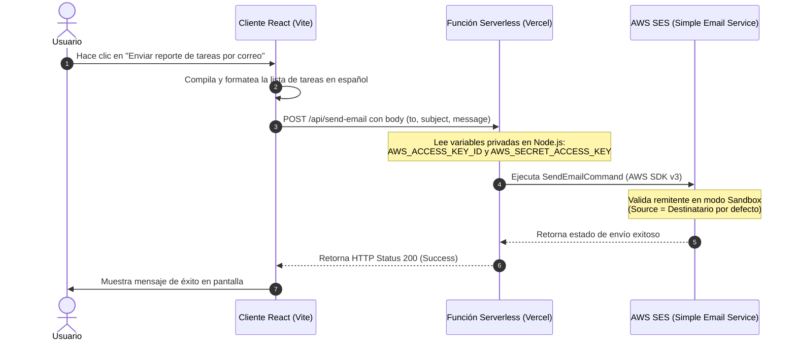

# Gestor de Tareas Estratégico (Proyecto Integrador M4 - Soy Henry)

Este proyecto es una aplicación web SPA (Single Page Application) desarrollada para gestionar tareas diarias de forma organizada, persistente y accesible en tiempo real. Forma parte del proyecto integrador para la carrera de **Full Stack Developer en Soy Henry**.

---

## 🚀 URL de Producción

El proyecto se encuentra desplegado y disponible de forma pública en el siguiente enlace:
👉 **[https://gestor-de-tareas-soyhenry.vercel.app](https://gestor-de-tareas-soyhenry.vercel.app)** *(Sustituye esta URL por tu enlace de despliegue final obtenido de Vercel)*

---

## 🛠️ Descripción del Proyecto

La aplicación permite a las organizaciones y empleados administrar sus pendientes de forma individual mediante una interfaz intuitiva y moderna. 
Sus características principales incluyen:
- **Autenticación Completa**: Registro e inicio de sesión seguro a través de correo/contraseña y mediante el botón oficial de inicio de sesión con Google.
- **Seguridad e Intimidad**: Los datos están aislados por usuario en la base de datos (Reglas de Seguridad de Firestore).
- **Control Visual interactivo**: Posibilidad de ocultar o mostrar contraseñas mediante controles de emojis interactivos (`🙈` / `🐵`).
- **CRUD Completo de Tareas**: Creación, listado reactivo en tiempo real con `onSnapshot`, actualización (edición de título y descripción inline), cambio de estado (completado/pendiente) y eliminación de tareas.
- **Reportes por Correo**: Generación automática de reportes de tareas formateados en español y enviados directamente al buzón del usuario mediante una arquitectura Serverless que conecta con AWS SES.
- **Diseño Responsivo Premium**: Interfaz oscura con acentos visuales vibrantes, transiciones suaves y microinteracciones de interfaz de usuario.

---

## 🏗️ Decisiones Arquitectónicas

1. **Frontend con React + TypeScript + Vite**:
   - **Vite** proporciona un ciclo de desarrollo ultrarrápido y compilaciones optimizadas.
   - **TypeScript** garantiza la seguridad de tipos, reduciendo significativamente errores de desarrollo en tiempo de ejecución.
2. **Backend Serverless (BaaS) con Firebase**:
   - **Firebase Auth** para administrar de forma descentralizada el registro e inicio de sesión del usuario.
   - **Cloud Firestore** para persistir tareas, configurando reglas estrictas para validar que los usuarios solo puedan leer, escribir o modificar documentos donde `request.auth.uid == resource.data.userId`.
3. **Función Serverless para Envío de Correo (Vercel Functions + AWS SES)**:
   - **Separación de Responsabilidades**: Las credenciales privadas de AWS SES (`AWS_ACCESS_KEY_ID`, `AWS_SECRET_ACCESS_KEY`) se guardan de forma segura en las variables de entorno del servidor en Vercel. 
   - **Proxy de Enrutamiento**: El frontend realiza una solicitud POST a `/api/send-email`. Esta solicitud es procesada por una función serverless (`api/send-email.js` que delega la lógica a `functions/send-email.js`), la cual consume el SDK modular v3 de AWS SES (`@aws-sdk/client-ses`), aislando las llaves secretas del navegador del cliente.
4. **Mocks Estables en Pruebas Automatizadas (Vitest + RTL)**:
   - Para prevenir problemas de falta de memoria (OOM) y acelerar los tests en entornos virtuales de `jsdom`, se crearon mocks estables y globales en `tests/setup.ts` para el SDK de Firebase.
   - Se estructuró un mock del hook `useAuth` que devuelve una referencia de objeto constante (`mockUser`), eliminando los bucles de re-renderizado infinito en los tests de React.

---

## 📬 Flujo de Envío de Emails

El siguiente diagrama de secuencia describe cómo se procesa y despacha el correo electrónico de reporte de tareas:



---

## ⚙️ Variables de Entorno Necesarias

Debes configurar los siguientes archivos de entorno para que el proyecto funcione en su totalidad:

### 1. Frontend (.env en la raíz para desarrollo local)
Estas variables se utilizan para inicializar el SDK cliente de Firebase. Vercel las cargará también en producción:
```env
VITE_FIREBASE_API_KEY=tu_api_key_de_firebase
VITE_FIREBASE_AUTH_DOMAIN=tu_auth_domain_de_firebase
VITE_FIREBASE_PROJECT_ID=tu_project_id_de_firebase
VITE_FIREBASE_STORAGE_BUCKET=tu_storage_bucket
VITE_FIREBASE_MESSAGING_SENDER_ID=tu_messaging_sender_id
VITE_FIREBASE_APP_ID=tu_app_id
```

### 2. Backend (Configuradas en el panel de Vercel)
Estas credenciales privadas jamás deben exponerse en el frontend (no llevan el prefijo `VITE_`):
```env
AWS_ACCESS_KEY_ID=tu_access_key_id_de_aws
AWS_SECRET_ACCESS_KEY=tu_secret_access_key_de_aws
AWS_REGION=us-east-1
SENDER_EMAIL=tu-email-verificado-en-ses@correo.com
```
*(Nota: Si `SENDER_EMAIL` no está configurado, la función serverless utilizará por defecto el correo del destinatario en el parámetro `Source` para poder enviar correos autodirigidos dentro del Sandbox de AWS SES).*

---

## 🛠️ Instrucciones de Instalación

Sigue estos pasos para instalar y ejecutar el proyecto localmente:

1. **Clonar el repositorio**:
   ```bash
   git clone https://github.com/tu-usuario/gestor-de-tareas.git
   cd gestor-de-tareas
   ```

2. **Instalar dependencias**:
   ```bash
   npm install
   ```

3. **Configurar el entorno**:
   - Crea un archivo `.env` en la raíz del proyecto basándote en la sección anterior.

4. **Ejecutar en modo desarrollo**:
   ```bash
   npm run dev
   ```
   La aplicación estará disponible en `http://localhost:5173`.

5. **Ejecutar Pruebas Automatizadas (Vitest)**:
   ```bash
   npx vitest run
   ```

6. **Ejecutar Verificación de Tipos (TypeScript)**:
   ```bash
   npx tsc --noEmit
   ```

---

## 🤖 Memoria de Integración de Inteligencia Artificial

Durante el desarrollo del proyecto, se utilizó un modelo de **Inteligencia Artificial de código avanzado** bajo la modalidad de **Pair Programming**. 

### 1. Situaciones de Mayor Efectividad
- **Manejo de Memoria Virtual en Testings**: El testeo de componentes de React 19 con JSDOM suele provocar desbordamientos de memoria (`JavaScript heap out of memory`) debido a las dependencias del SDK real de Firebase. La IA fue crítica para identificar este fallo y proponer la centralización de mocks globales estables de Firebase en `setup.ts`.
- **Estructuración del Enrutamiento Proxy**: En desarrollo local con Vite, no existe un backend de Node nativo que interprete la carpeta `/api` automáticamente. La IA diseñó una arquitectura de proxy transparente, recomendando un archivo `vercel.json` con reescrituras de rutas, permitiendo que el mismo código funcione de manera idéntica tanto localmente en desarrollo como en producción en Vercel.
- **Resolución de Bucles Infinitos en React**: Identificó rápidamente que declarar objetos planos directamente en los mocks de retorno de hooks (como `useAuth`) provocaba que React detectara cambios de referencia en cada renderizado, forzando la ejecución infinita del hook `useEffect` de Firestore. La solución fue definir referencias estables (`mockUser`) fuera de la fábrica del mock.

### 2. Patrones y Buenas Prácticas Descubiertas
- **Planificación por Fases (Planning Mode)**: Antes de realizar cualquier cambio directo en el código, el uso de artefactos de planificación (`implementation_plan.md` y `task.md`) sirvió para alinear la arquitectura propuesta, prever dependencias de paquetes y resolver dilemas de diseño (como la edición inline en vez de modales) antes de la escritura de código.
- **Centralización de Mocks de Infraestructura**: El uso de mocks a nivel de archivo de configuración (`setup.ts`) garantiza que las pruebas de cualquier componente se mantengan aisladas, livianas y consistentes, impidiendo fugas de memoria colaterales.
- **Uso Estricto de TypeScript**: Evitar el uso de `any` en los mocks de pruebas obligó a definir estructuras tipadas equivalentes a las reales, previniendo errores silenciosos de desincronización de contratos de datos.
